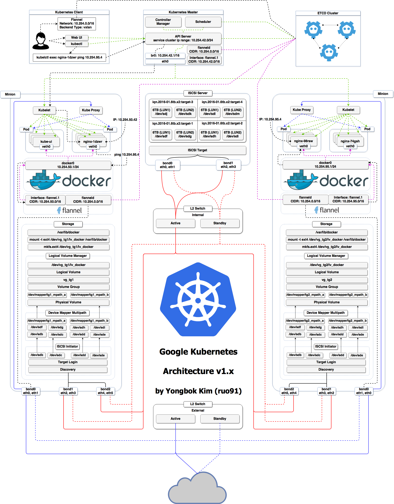

# Kubernetes concepts

- Kubernetes is a container management system

- It runs and manages containerized applications on a cluster

--

- What does that really mean?

---

## Basic things we can ask Kubernetes to do

--

- Start 5 containers using image `atseashop/api:v1.3`

--

- Place an internal load balancer in front of these containers

--

- Start 10 containers using image `atseashop/webfront:v1.3`

--

- Place a public load balancer in front of these containers

--

- It's Black Friday (or Christmas), traffic spikes, grow our cluster and add containers

--

- New release! Replace my containers with the new image `atseashop/webfront:v1.4`

--

- Keep processing requests during the upgrade; update my containers one at a time

---

## Other things that Kubernetes can do for us

- Basic autoscaling

- Blue/green deployment, canary deployment

- Long running services, but also batch (one-off) jobs

- Overcommit our cluster and *evict* low-priority jobs

- Run services with *stateful* data (databases etc.)

- Fine-grained access control defining *what* can be done by *whom* on *which* resources

- Integrating third party services (*service catalog*)

- Automating complex tasks (*operators*)

---

## Kubernetes architecture

---

class: pic

---

## Kubernetes architecture

- Ha ha ha ha

- OK, I was trying to scare you, it's much simpler than that ❤️

---

class: pic

---

## Credits

- The first schema is a Kubernetes cluster with storage backed by multi-path iSCSI

  (Courtesy of [Yongbok Kim](https://www.yongbok.net/blog/))

- The second one is an good simplified representation of a Kubernetes cluster

  (Courtesy of [Imesh Gunaratne](https://medium.com/containermind/a-reference-architecture-for-deploying-wso2-middleware-on-kubernetes-d4dee7601e8e))

---

## Kubernetes architecture: the master

- The Kubernetes logic (its "brains") is a collection of services:

  - the API server (our point of entry to everything!)
  - core services like the scheduler and controller manager
  - `etcd` (a highly available key/value store; the "database" of Kubernetes)

- Together, these services form what is called the "master"

- These services can run straight on a host, or in containers
   
  (that's an implementation detail)

- `etcd` can be run on separate machines (first schema) or colocated (second schema)

- We need at least one master, but we can have more (for high availability)

---

## Kubernetes architecture: the nodes

- The nodes executing our containers run another collection of services:

  - a container Engine (typically Docker)
  - kubelet (the "node agent")
  - kube-proxy (a necessary but not sufficient network component)

- Nodes were formerly called "minions"

- It is customary to *not* run apps on the node(s) running master components

  (Except when using small development clusters) 

---

## Do we need to run Docker at all?

No!

--

- By default, Kubernetes uses the Docker Engine to run containers

- We could also use `rkt` ("Rocket") from CoreOS

- Or leverage through the *Container Runtime Interface* other pluggable runtimes

  (like CRI-O, or containerd)

---

## Do we need to run Docker at all?

Yes!

--

- In this workshop, we run our app on a single node first

- We will need to build images and ship them around

- We can do these things without Docker
   
  (and get diagnosed with NIH syndrome)

- Docker is still the most stable container engine today
   
  (but other options are maturing very quickly)

---

## Do we need to run Docker at all?

- On our development environments, CI pipelines ... :

  *Yes, almost certainly*

- On our production servers:

  *Yes (today)*

  *Probably not (in the future)*

.footnote[More information about CRI [on the Kubernetes blog](http://blog.kubernetes.io/2016/12/]container-runtime-interface-cri-in-kubernetes.html).

---

## Kubernetes resources

- The Kubernetes API defines a lot of objects called *resources*

- These resources are organized by type, or `Kind` (in the API)

- A few common resource types are:

  - node (self-explanatory)
  - pod (group of containers running together on a node)
  - service (stable network endpoint to connect to one or multiple containers)
  - namespace (more-or-less isolated group of things)
  - secret (bundle of sensitive data to be passed to a container)
 
  And much more! (We can see the full list by running `kubectl get`)

---

# Declarative vs imperative

- Kubernetes puts a very strong emphasis on being *declarative*

- Declarative:

  *I want a cup of tea. Make it happen.*

- Imperative:

  *Boil some water. Pour it in a teapot. Add tea leaves. Steep for a while. Serve in cup.*

--

- Declarative seems simpler at first ... 

--

- ... As long as you know how to brew tea

---

## Declarative vs imperative

- What declarative would really be:

  *I want a cup of tea, obtained by pouring an infusion¹ of tea leaves in a cup.*

--

  *¹An infusion is obtained by letting the object steep a few minutes in hot² water.*

--

  *²Hot liquid is obtained by pouring it in an appropriate container³ and setting it on a stove.*

--

  *³Ah, finally, containers! Something we know about. Let's get to work, shall we?*

---

## Declarative vs imperative

- Imperative systems:

  - simpler

  - if a task is interrupted, we have to restart from scratch

- Declarative systems:

  - if a task is interrupted (or if we show up to the party half-way through),
    we can figure out what's missing and do only what's necessary

  - we need to be able to *observe* the system

  - ... and compute a "diff" between *what we have* and *what we want*

---

## Declarative vs imperative in Kubernetes

- Virtually everything we create in Kubernetes is created from a *spec*

- Watch for the `spec` fields in the YAML files later!

- The *spec* describes *how we want the thing to be*

- Kubernetes will *reconcile* the current state with the spec
   (technically, this is done by a number of *controllers*)

- When we want to change some resource, we update the *spec*

- Kubernetes will then *converge* that resource
