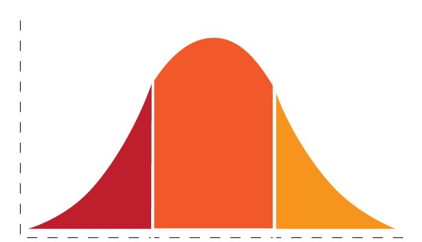

class: title, self-paced

Docker   Orchestration   Workshop

---

class: title, in-person

.small[

Deploy and scale containers with Docker native, open source orchestration

.small[.small[

**Be kind to the WiFi!**

*Use the 5G network*
 
*Don't use your hotspot*
 
*Don't stream videos from YouTube, Netflix, etc.
 (if you're bored, watch local content instead)*

Thank you!

]
]
]

---

class: in-person

## Intros

- Hello! We are
  AJ ([@s0ulshake](https://twitter.com/s0ulshake))
  &
  Jérôme ([@jpetazzo](https://twitter.com/jpetazzo))

--

class: in-person

- This is our collective Docker knowledge:

  

<!--
Reminder, when updating the agenda: when people are told to show
up at 9am, they usually trickle in until 9:30am (except for paid
training sessions). If you're not sure that people will be there
on time, it's a good idea to have a breakfast with the attendees
at e.g. 9am, and start at 9:30.
-->

---

class: in-person

## Agenda

<!--
- Agenda:
-->

<!--

.small[
- 09:00-10:30 part 1
- 10:30-11:00 coffee break
- 11:00-12:30 part 2
- 12:00-13:00 lunch break
- 13:00-14:30 part 3
- 14:30-14:45 coffee break
- 14:45-16:00 part 4
- 16:00-16:01 Q&A
]

-->

- The tutorial will run from 9:00am to 12:20pm

- This will be fast-paced, but DON'T PANIC!

- All the content is publicly available (slides, code samples, scripts)

  Upstream URL: https://github.com/jpetazzo/orchestration-workshop

- There will be a coffee break at 10:30am
   
  (please remind me if I forget about it!)

- Feel free to interrupt for questions at any time

- Live feedback, questions, help on [Gitter](chat)

  http://container.training/chat

---

## A brief introduction

- This was initially written to support in-person,
  instructor-led workshops and tutorials

- You can also follow along on your own, at your own pace

- We included as much information as possible in these slides

- We recommend having a mentor to help you ...

- ... Or be comfortable spending some time reading the Docker
 [documentation](https://docs.docker.com/) ...

- ... And looking for answers in the [Docker forums](forums.docker.com),
  [StackOverflow](http://stackoverflow.com/questions/tagged/docker),
  and other outlets

---

class: self-paced

## Hands on, you shall practice

- Nobody ever became a Jedi by spending their lives reading Wookiepedia

- Likewise, it will take more than merely *reading* these slides
  to make you an expert

- These slides include *tons* of exercises

- They assume that you have access to a cluster of Docker nodes

- If you are attending a workshop or tutorial:
   you will be given specific instructions to access your cluster

- If you are doing this on your own:
   you can use
  [Play-With-Docker](http://www.play-with-docker.com/) and
  read [these instructions](https://github.com/jpetazzo/orchestration-workshop#using-play-with-docker) for extra
  details
