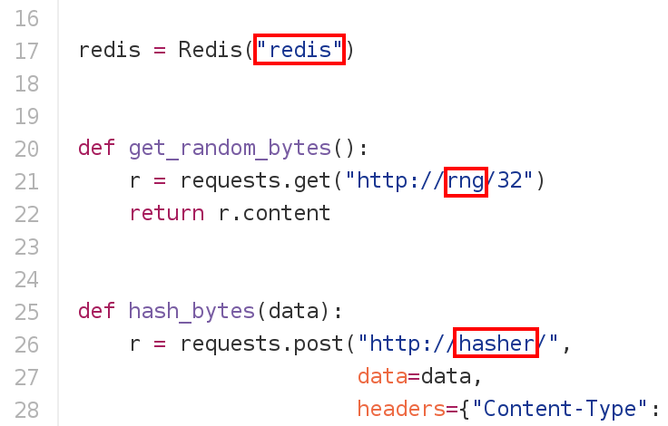

# Our sample application

- Visit the GitHub repository with all the materials of this workshop:
  <br/>https://github.com/jpetazzo/orchestration-workshop

- The application is in the [dockercoins](
  https://github.com/jpetazzo/orchestration-workshop/tree/master/dockercoins)
  subdirectory

- Let's look at the general layout of the source code:

  there is a Compose file [docker-compose.yml](
  https://github.com/jpetazzo/orchestration-workshop/blob/master/dockercoins/docker-compose.yml) ...

  ... and 4 other services, each in its own directory:

  - `rng` = web service generating random bytes
  - `hasher` = web service computing hash of POSTed data
  - `worker` = background process using `rng` and `hasher`
  - `webui` = web interface to watch progress

---

class: extra-details

## Compose file format version

*Particularly relevant if you have used Compose before...*

- Compose 1.6 introduced support for a new Compose file format (aka "v2")

- Services are no longer at the top level, but under a `services` section

- There has to be a `version` key at the top level, with value `"2"` (as a string, not an integer)

- Containers are placed on a dedicated network, making links unnecessary

- There are other minor differences, but upgrade is easy and straightforward

---

## Links, naming, and service discovery

- Containers can have network aliases (resolvable through DNS)

- Compose file version 2+ makes each container reachable through its service name

- Compose file version 1 did require "links" sections

- Our code can connect to services using their short name

  (instead of e.g. IP address or FQDN)

- Network aliases are automatically namespaced

  (i.e. you can have multiple apps declaring and using a service named `database`)

---

## Example in `worker/worker.py`



---

## What's this application?

---

class: pic


(DockerCoins 2016 logo courtesy of [@XtlCnslt](https://twitter.com/xtlcnslt) and [@ndeloof](https://twitter.com/ndeloof). Thanks!)

---

## What's this application?

- It is a DockerCoin miner! 💰🐳📦🚢

--

- No, you can't buy coffee with DockerCoins

--

- How DockerCoins works:

  - `worker` asks to `rng` to generate a few random bytes

  - `worker` feeds these bytes into `hasher`

  - and repeat forever!

  - every second, `worker` updates `redis` to indicate how many loops were done

  - `webui` queries `redis`, and computes and exposes "hashing speed" in your browser

---

## Getting the application source code

- We will clone the GitHub repository

- The repository also contains scripts and tools that we will use through the workshop

.exercise[

<!--
```bash
if [ -d orchestration-workshop ]; then
  mv orchestration-workshop orchestration-workshop.$$
fi
```
-->

- Clone the repository on `node1`:
  ```bash
  git clone git://github.com/jpetazzo/orchestration-workshop
  ```

]

(You can also fork the repository on GitHub and clone your fork if you prefer that.)

---

# Running the application

Without further ado, let's start our application.

.exercise[

- Go to the `dockercoins` directory, in the cloned repo:
  ```bash
  cd ~/orchestration-workshop/dockercoins
  ```

- Use Compose to build and run all containers:
  ```bash
  docker-compose up
  ```

<!--
```wait units of work done```
```keys ^C```
-->

]

Compose tells Docker to build all container images (pulling
the corresponding base images), then starts all containers,
and displays aggregated logs.

---

## Lots of logs

- The application continuously generates logs

- We can see the `worker` service making requests to `rng` and `hasher`

- Let's put that in the background

.exercise[

- Stop the application by hitting `^C`

]

- `^C` stops all containers by sending them the `TERM` signal

- Some containers exit immediately, others take longer
  <br/>(because they don't handle `SIGTERM` and end up being killed after a 10s timeout)

---

## Restarting in the background

- Many flags and commands of Compose are modeled after those of `docker`

.exercise[

- Start the app in the background with the `-d` option:
  ```bash
  docker-compose up -d
  ```

- Check that our app is running with the `ps` command:
  ```bash
  docker-compose ps
  ```

]

`docker-compose ps` also shows the ports exposed by the application.

---

class: extra-details

## Viewing logs

- The `docker-compose logs` command works like `docker logs`

.exercise[

- View all logs since container creation and exit when done:
  ```bash
  docker-compose logs
  ```

- Stream container logs, starting at the last 10 lines for each container:
  ```bash
  docker-compose logs --tail 10 --follow
  ```

<!--
```wait units of work done```
```keys ^C```
-->

]

Tip: use `^S` and `^Q` to pause/resume log output.

---

class: extra-details

## Upgrading from Compose 1.6

.warning[The `logs` command has changed between Compose 1.6 and 1.7!]

- Up to 1.6

  - `docker-compose logs` is the equivalent of `logs --follow`

  - `docker-compose logs` must be restarted if containers are added

- Since 1.7

  - `--follow` must be specified explicitly

  - new containers are automatically picked up by `docker-compose logs`

---

## Connecting to the web UI

- The `webui` container exposes a web dashboard; let's view it

.exercise[

- With a web browser, connect to `node1` on port 8000

- Remember: the `nodeX` aliases are valid only on the nodes themselves

- In your browser, you need to enter the IP address of your node

<!-- ```open http://node1:8000``` -->

]

You should see a speed of approximately 4 hashes/second.

More precisely: 4 hashes/second, with regular dips down to zero.
<br/>This is because Jérôme is incapable of writing good frontend code.
<br/>Don't ask. Seriously, don't ask. This is embarrassing.

---

class: extra-details

## Why does the speed seem irregular?

- The app actually has a constant, steady speed: 3.33 hashes/second
  <br/>
  (which corresponds to 1 hash every 0.3 seconds, for *reasons*)

- The worker doesn't update the counter after every loop, but up to once per second

- The speed is computed by the browser, checking the counter about once per second

- Between two consecutive updates, the counter will increase either by 4, or by 0

- The perceived speed will therefore be 4 - 4 - 4 - 0 - 4 - 4 - etc.

*We told you to not ask!!!*

---

## Scaling up the application

- Our goal is to make that performance graph go up (without changing a line of code!)

--

- Before trying to scale the application, we'll figure out if we need more resources

  (CPU, RAM...)

- For that, we will use good old UNIX tools on our Docker node

---

## Looking at resource usage

- Let's look at CPU, memory, and I/O usage

.exercise[

- run `top` to see CPU and memory usage (you should see idle cycles)

<!--
```bash top```

```wait Tasks```
```keys ^C```
-->

- run `vmstat 1` to see I/O usage (si/so/bi/bo)
  <br/>(the 4 numbers should be almost zero, except `bo` for logging)

<!--
```bash vmstat 1```

```wait memory```
```keys ^C```
-->

]

We have available resources.

- Why?
- How can we use them?

---

## Scaling workers on a single node

- Docker Compose supports scaling
- Let's scale `worker` and see what happens!

.exercise[

- Start one more `worker` container:
  ```bash
  docker-compose scale worker=2
  ```

- Look at the performance graph (it should show a x2 improvement)

- Look at the aggregated logs of our containers (`worker_2` should show up)

- Look at the impact on CPU load with e.g. top (it should be negligible)

]

---

## Adding more workers

- Great, let's add more workers and call it a day, then!

.exercise[

- Start eight more `worker` containers:
  ```bash
  docker-compose scale worker=10
  ```

- Look at the performance graph: does it show a x10 improvement?

- Look at the aggregated logs of our containers

- Look at the impact on CPU load and memory usage

]

---

# Identifying bottlenecks

- You should have seen a 3x speed bump (not 10x)

- Adding workers didn't result in linear improvement

- *Something else* is slowing us down

--

- ... But what?

--

- The code doesn't have instrumentation

- Let's use state-of-the-art HTTP performance analysis!
  <br/>(i.e. good old tools like `ab`, `httping`...)

---

## Accessing internal services

- `rng` and `hasher` are exposed on ports 8001 and 8002

- This is declared in the Compose file:

  ```yaml
    ...
    rng:
      build: rng
      ports:
      - "8001:80"

    hasher:
      build: hasher
      ports:
      - "8002:80"
    ...
  ```

---

## Measuring latency under load

We will use `httping`.

.exercise[

- Check the latency of `rng`:
  ```bash
  httping -c 10 localhost:8001
  ```

- Check the latency of `hasher`:
  ```bash
  httping -c 10 localhost:8002
  ```

]

`rng` has a much higher latency than `hasher`.

---

## Let's draw hasty conclusions

- The bottleneck seems to be `rng`

- *What if* we don't have enough entropy and can't generate enough random numbers?

- We need to scale out the `rng` service on multiple machines!

Note: this is a fiction! We have enough entropy. But we need a pretext to scale out.

(In fact, the code of `rng` uses `/dev/urandom`, which never runs out of entropy...
<br/>
...and is [just as good as `/dev/random`](http://www.slideshare.net/PacSecJP/filippo-plain-simple-reality-of-entropy).)

---

## Clean up

- Before moving on, let's remove those containers

.exercise[

- Tell Compose to remove everything:
  ```bash
  docker-compose down
  ```

]
